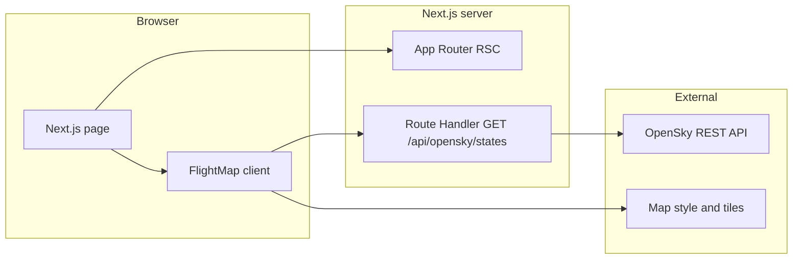

# Product: SkyTrack — Live Flight Map

> Интерактивная карта мира с периодическим обновлением позиций воздушных судов из OpenSky Network: панорамирование, зум, клик по самолёту и карточка с доступными полями API — простой публичный viewer без аккаунтов и SaaS-сложности.

## Overview

- **Problem:** Людям, интересующимся авиацией или ожидающим рейс, нужен быстрый визуальный ответ «где сейчас самолёт» на карте без установки тяжёлых приложений, регистрации и скрытых ограничений данных.
- **Target Audience:** Наблюдатели за полётами на карте; люди, встречающие рейс и желающие ориентироваться по открытым данным в пределах покрытия ADS-B/OpenSky.
- **Value Proposition:** Минималистичный open-data viewer с прозрачным дисклеймером о задержке и покрытии; открытый стек (Next.js, MapLibre, OpenSky REST), пригодный как портфолио и как эталон честного UX для любительского трекинга.
- **Market Opportunity:** Спрос на flight tracking стабильно высокий; крупные игроки оптимизированы под монетизацию и глубину данных. Ниша — **лёгкий публичный слой** на открытом API, не претендующий на паритет с коммерческими трекерами.

## Competitors

| Name | URL | Key Features | Monetization | Weaknesses |
|------|-----|--------------|--------------|------------|
| Flightradar24 | https://www.flightradar24.com/ | Карта и мобильные приложения, история рейсов на платных планах, комбинация ADS-B/MLAT/radar, широкое покрытие | Freemium; подписки (например Gold); бизнес/API отдельно | Реклама и пэйволлы на продвинутых функциях; фильтрация части судов (например LADD) — пользователь не всегда видит «всё»; тяжеловесный продукт для задачи «просто карта» |
| FlightAware | https://www.flightaware.com/ | Отслеживание, аэропорты, история, бизнес-инструменты и API | Freemium; платные уровни и API | Бесплатный слой ограничен относительно полного продукта; фокус на авиа-бизнесе, не на минималистичном viewer |
| ADS-B Exchange | https://www.adsbexchange.com/ | Нефильтрованные ADS-B данные, сообщество фидеров, интерес для OSINT и энтузиастов | Спонсорство/подписки для расширенного доступа | UI менее полирован vs топовые карты; покрытие неравномерно по регионам; не позиционируется как «простой портфолио-map» |
| OpenSky Network | https://opensky-network.org/ | Исследовательская сеть, REST API, сырые state vectors, открытые данные | Некоммерческая инфраструктура; API с кредитами/лимитами | Нет целевого consumer-приложения уровня FR24; лимиты и разрешение по времени критичны для частых опросов |

## Target Users

### Persona 1: Alex — «Aviation curious»

- **Role:** Любитель авиации, открывает сайт из интереса или для скриншотов карты.
- **Behavior:** Раньше заходил на FR24/ADS-B Exchange, раздражается от рекламы или перегруженного UI.
- **Pain Points:** Хочет сразу карту и клик по самолёту без аккаунта; важно понимать, что данные не «GPS в кармане пилота».
- **Willingness to Pay:** Нулевая для этого продукта (портфолио / бесплатный viewer).

### Persona 2: Jordan — «Meeting a flight»

- **Role:** Встречает близких или следит за конкретным рейсом в рамках открытых данных.
- **Behavior:** Ищет в вебе карту полётов, сравнивает с табло аэропорта.
- **Pain Points:** Непонятно, насколько данные свежие и полные; страшно принимать решения по безопасности на основе карты.
- **Willingness to Pay:** Нулевая; ожидает бесплатный просмотр и явный дисклеймер.

## Monetization

- **Model:** Нет монетизации. Портфолио-проект и публичный демонстрационный viewer.
- **Pricing:** N/A.
- **Payment Integration:** N/A.
- **Success metrics (вместо выручки):** см. раздел Analytics — сессии, вовлечённость картой, доля пользователей, открывших детали судна.

## Funnel

| Step | Event Name | Description |
|------|------------|-------------|
| Home visit | `page_view_home` | Пользователь открыл главную страницу приложения |
| Map initialized | `map_ready` | Карта MapLibre успешно инициализирована (load/style) |
| Aircraft data on map | `aircraft_layer_shown` | После первого успешного получения и отображения слоя судов |
| Aircraft detail | `aircraft_selected` | Пользователь выбрал судно (клик по маркеру / открытие карточки) |
| Data/API error surfaced | `opensky_error_shown` | Пользователю показано сообщение об ошибке загрузки или лимита OpenSky |

## SEO

- **Primary Keywords:** live flight map, OpenSky flight tracker, ADS-B map
- **Long-tail Keywords:** real time aircraft map open data, track plane on map free, ICAO24 flight map, interactive flight map browser
- **Strategy:** Одна сильная главная с уникальным title/description, честный текст про источник данных и задержки (E-E-A-T); при необходимости позже — JSON-LD `WebApplication` и короткая страница «About / Data» без раздувания скоупа MVP.

---

## Features

### P0 — MVP

| Feature | Status | Effort | Impact | Acceptance Criteria |
|---------|--------|--------|--------|---------------------|
| World map pan & zoom (MapLibre) | planned | low | high | Пользователь может непрерывно панорамировать карту и изменять масштаб в пределах, разрешённых стилём; при отсутствии `NEXT_PUBLIC_MAP_STYLE_URL` загружается дефолтный стиль из кода (`demotiles.maplibre.org`); в консоли браузера нет необработанных ошибок, связанных с инициализацией карты, при нормальной сети |
| OpenSky aircraft layer + polling 5–10 s | planned | medium | high | Клиент или сервер запрашивает данные с фиксированным интервалом **от 5 до 10 секунд включительно**; после каждого успешного ответа маркеры/слой отражают актуальный набор `states` из ответа для отображаемой области (или глобально, если так реализовано); при ошибке HTTP или сети пользователь видит однозначное текстовое состояние (например баннер или inline), без молчаливого зависания |
| Click aircraft → detail card | planned | medium | high | По активации судна (клик по маркеру или эквивалент) отображается карточка/попап; в ней перечислены **все ненулевые поля** из [OpenSky state vector](https://openskynetwork.github.io/opensky-api/rest.html), применимые к выбранному объекту (минимум: `icao24`; при наличии в ответе — callsign, координаты, барометрическая/геометрическая высота, скорость, курс, вертикальная скорость, on ground, squawk и др. по спецификации API) |
| Legend / data disclaimer | planned | low | medium | На главном экране всегда видимый короткий блок текста: позиции **не** обновляются с точностью до секунды; качество зависит от покрытия OpenSky; **не** для навигации и критических решений |

### P1 — v1

| Feature | Status | Effort | Impact | Acceptance Criteria |
|---------|--------|--------|--------|---------------------|
| Search / filter by callsign or ICAO24 | planned | medium | medium | Поле ввода фильтрует отображаемый набор судов: по **ICAO24** (точное совпадение hex, регистронезависимо) и/или по **callsign** (подстрока без учёта регистра); при пустом запросе показывается полный набор для текущего режима данных; фильтрация применяется ≤ 300 ms после остановки ввода при типичном объёме данных на клиенте |
| Highlight selected aircraft | planned | low | medium | Выбранное судно визуально отличается от остальных (цвет, размер или обводка); снятие выбора возвращает базовый стиль |
| Follow selected aircraft on update | planned | medium | medium | При включённом «follow» центр карты после каждого успешного обновления позиций совпадает с координатами выбранного `icao24` (с допустимым сглаживанием анимацией карты, если используется); выключение follow прекращает автоматическое центрирование |

### P2 — Future

| Feature | Status | Effort | Impact | Acceptance Criteria |
|---------|--------|--------|--------|---------------------|
| Short position trail (last N minutes, client-only) | planned | medium | low | Для **одного** выбранного судна на клиенте хранится история точек за последние **N** минут (N задан константой в коде, например 15); на карте отображается полилиния из ≥ 2 точек, если данные были; очистка при смене выбранного судна |
| Dark theme (map + UI) | planned | medium | medium | Переключатель или системная тема задаёт тёмные цвета UI (Tailwind/shadcn-паттерн); карта использует тёмный совместимый со стилем MapLibre style URL или эквивалент; контраст текста соответствует WCAG 2.1 AA для основного текста интерфейса |

## User Stories

```gherkin
Feature: World map pan and zoom
  Scenario: User explores the map
    Given the home page has loaded
    When the user pans and zooms the map
    Then the map view updates accordingly without console errors from map initialization

  Scenario: Default style when no custom URL
    Given NEXT_PUBLIC_MAP_STYLE_URL is not set
    When the map component mounts
    Then the default MapLibre demo style loads successfully
```

```gherkin
Feature: OpenSky aircraft layer with polling
  Scenario: Aircraft appear after data loads
    Given the map is ready and OpenSky data is available
    When the polling interval elapses
    Then aircraft positions are rendered on the map from the latest successful response

  Scenario: User sees error when data fails
    Given the map is ready
    When the OpenSky request fails or returns an error status
    Then the user sees a clear error message in the UI
```

```gherkin
Feature: Aircraft detail on click
  Scenario: User opens detail card
    Given aircraft markers are visible on the map
    When the user selects an aircraft
    Then a card or popup shows available non-null fields from the OpenSky state vector for that aircraft

  Scenario: Minimum identification
    Given a selected aircraft has only icao24 populated
    When the user opens the detail card
    Then at least icao24 is shown
```

```gherkin
Feature: Data disclaimer and legend
  Scenario: Disclaimer is always visible
    Given the user is on the home page
    When the page is viewed on a desktop or mobile viewport
    Then a short disclaimer about data latency, OpenSky coverage, and non-navigational use is visible without opening modals
```

## Out of Scope

- Telegram-бот и любые push-уведомления
- Корабли, погодные оверлеи, МКС, землетрясения
- «Живое» спутниковое видео или снимки с уличным уровнем детализации
- Паритет с Flightradar24 / FlightAware по глубине данных, истории и коммерческим API
- Платные тарифы, биллинг и аккаунты пользователей на текущем этапе

## Open Questions

- [ ] Продакшен-стиль карты: оставаться на бесплатном vector demo vs собственный/платный tile provider (MapTiler, Protomaps и т.д.)
- [ ] Стратегия лимитов OpenSky: только анонимные запросы vs учётная запись API; обязателен ли server-side bbox по viewport + debounce при пан/зум для экономии кредитов
- [ ] Отдельная страница `/about` для SEO или достаточно блока на главной
- [ ] Концентрация трафика на IP Vercel при server-side прокси: при росте посещаемости может потребоваться кэширование, bbox-запросы или повышение tier OpenSky

---

## Tech Stack

- **Framework:** Next.js 16 (App Router)
- **Language:** TypeScript (`strict: true` in `tsconfig.json`)
- **Database:** Нет на MVP; PostgreSQL / Supabase только при появлении аккаунтов или сохранённых рейсов
- **ORM:** N/A (MVP)
- **Auth:** N/A (MVP)
- **Hosting:** Vercel (целевой деплой)
- **UI:** Tailwind CSS v4 + shadcn-паттерн (`components.json`, `@base-ui/react`, `class-variance-authority`, `tailwind-merge`, `lucide-react`)
- **Map:** MapLibre GL JS (`maplibre-gl`); опционально `NEXT_PUBLIC_MAP_STYLE_URL` (см. `.env.example`)
- **Validation:** Zod
- **Analytics:** Не подключено в репозитории; план событий — см. Funnel и таблицу ниже
- **Payments:** N/A
- **Key APIs:** [OpenSky Network REST API](https://openskynetwork.github.io/opensky-api/rest.html) — `GET /states/all` (опционально bbox `lamin`, `lomin`, `lamax`, `lomax`; фильтр `icao24`)

## UX / Design

- **Style:** Минималистичный, карта — основной фокус; лёгкий хедер как в текущей главной странице.
- **Theme:** Светлая по умолчанию; тёмная — P2.
- **Typography:** Системный/Next.js font stack из `layout.tsx` (без смены на MVP, если не требуется дизайн-ревью).
- **Colors:** Нейтральные семантические цвета Tailwind (`muted`, `border`, `background`); акцент для выбранного судна — в P1.
- **Key Screens:**
  - **Home** — полноэкранная карта, хедер с названием SkyTrack, легенда/дисклеймер, слой судов, карточка деталей по клику
- **User Flows:**
  - Открыть сайт → дождаться карты → увидеть самолёты → кликнуть по судну → прочитать поля → (P1) ввести callsign/ICAO24 → подсветка / follow

## Architecture



- **Текущая реализация в репозитории:** `src/app/page.tsx` рендерит `MapSection`; `map-section.tsx` динамически подгружает `FlightMap` с `ssr: false`; `flight-map.tsx` создаёт экземпляр `maplibregl.Map`; `next.config.ts` содержит `transpilePackages: ["maplibre-gl"]`.
- **API Endpoints (планируемые):**
  - `GET /api/opensky/states` — прокси к `https://opensky-network.org/api/states/all` с опциональными query-параметрами bbox / `icao24`; серверная валидация и парсинг ответа (Zod); заголовки лимитов OpenSky (`X-Rate-Limit-*`) можно пробрасывать или логировать для отладки
- **DB Schema (MVP):** нет
- **Key Patterns:** клиентская только карта; избежание SSR для WebGL; при прокси — один исходящий IP деплоя → учитывать [кредиты OpenSky](https://openskynetwork.github.io/opensky-api/rest.html#limitations) (анонимно: 400 кредитов/сутки на bucket `/states/*`; глобальный `states/all` стоит 4 кредита за запрос; bbox ≤ 25 sq° — 1 кредит)

### OpenSky limits (для дизайна polling и прокси)

- Анонимные запросы: параметр `time` **игнорируется**; временное разрешение данных **10 секунд**.
- Аутентифицированные: до **1 часа** в прошлое для state vectors; разрешение **5 секунд**.
- Исчерпание кредитов: ответ **429** с `X-Rate-Limit-Retry-After-Seconds`.

---

## Analytics

- **KPIs:**

  | Metric | Baseline | Target (Month 1) | Target (Month 6) |
  |--------|----------|------------------|------------------|
  | Unique visitors / week | 0 | 50 | 200 |
  | Avg. session duration (home) | 0 min | 1.5 min | 2.5 min |
  | Share of sessions with `aircraft_selected` | 0% | 15% | 25% |

- **Event Tracking Plan:**

  | Event | Trigger | Properties |
  |-------|---------|------------|
  | `page_view_home` | Main route view | `referrer`, `viewport_w`, `viewport_h` |
  | `map_ready` | Map `load` or style loaded | `style_url_host` (без секретов) |
  | `aircraft_layer_shown` | First successful states render | `state_count` (число судов) |
  | `aircraft_selected` | Open detail | `icao24`, `has_callsign` |
  | `opensky_error_shown` | User-visible error | `http_status`, `error_code` |

## Growth Hypotheses

| Hypothesis | Status | Metric | Baseline | Target | Result |
|------------|--------|--------|----------|--------|--------|
| Если видимый дисклеймер про задержку данных на главной, доля быстрых отказов (bounce за первые 15 с) снизится относительно варианта без него | planned | Bounce rate за первые 15 с | — | −10% относительно контроля | — |
| Если в meta description указаны «OpenSky» и «open data», CTR из органического поиска по длинным запросам вырастет | planned | Organic CTR (long-tail bucket) | — | +15% vs previous title | — |

## Insights

_This section is updated by the Growth skill based on analytics data._

---

## Changelog

### 2026-04-08 — Initial product discovery

- Created `product.md` with competitors, OpenSky API limits, personas, viewer funnel, SEO, P0/P1/P2 features with acceptance criteria, Gherkin user stories for P0, tech stack and architecture aligned with repository (`package.json`, `src/`).
